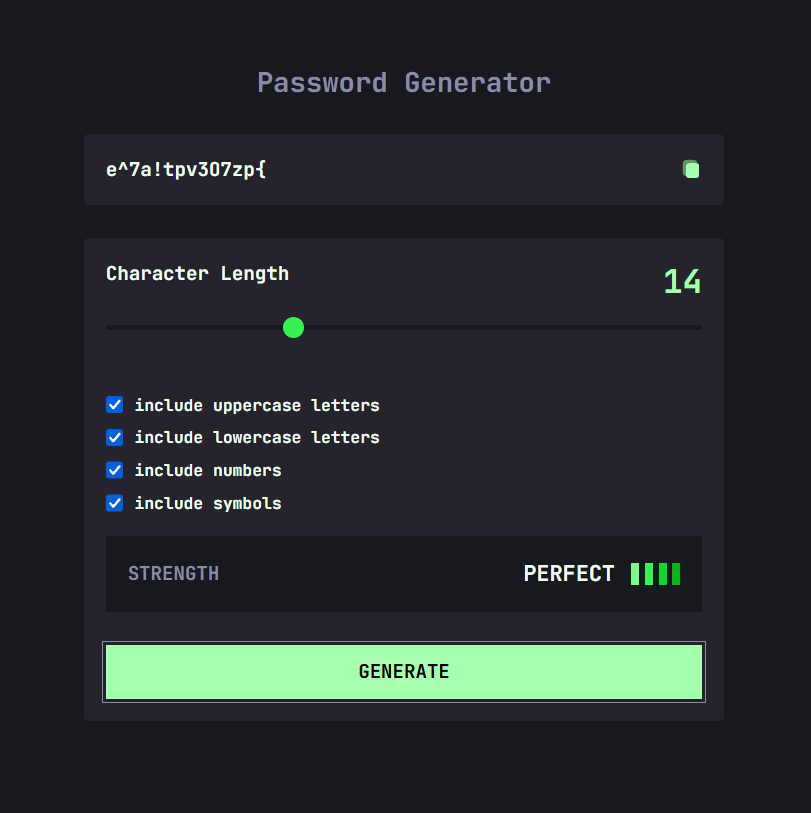

# GenPass - Password Generator

## Overview

GenPass is an intuitive and feature-rich password generator built with React and styled using Tailwind CSS. Generate strong and personalized passwords effortlessly with user-friendly features.

## Live Demo

Explore the live demo: [GenPass Live Demo](https://genpass-wm.netlify.app/)

## Deployment Status

[](https://app.netlify.com/sites/genpass-wm/deploys)

## Features

- **Adjustable Password Length:** Choose the length of your password according to your security requirements.
- **Customizable Criteria:** Include or exclude uppercase, lowercase, numbers, and symbols based on your preferences.
- **Visual Password Strength Indicator:** Easily assess the strength of your generated password.
- **One-Click Copy:** Quickly copy your generated password to the clipboard with a single click.

## Screenshots



## Getting Started

1. **Clone the repository:**

   ```bash
   git clone https://github.com/shaarkr/gen-pass.git
   ```

2. **Navigate to the project directory:**

   ```bash
   cd gen-pass
   ```

3. **Install dependencies using Yarn:**

   ```bash
   yarn install
   ```

4. **Start the development server:**

   ```bash
   yarn dev
   ```

5. **Open your browser and go to:**

   ```bash
   http://localhost:3000
   ```

## Usage

1. **Customize Your Password:**

   - Adjust the password length slider.
   - Toggle options for uppercase, lowercase, numbers, and symbols.

2. **Generate a Secure Password:**

   - Click the "Generate" button to create a strong and secure password.

3. **Visual Strength Indicator:**

   - Check the visual indicator to assess the strength of your password.

4. **Copy to Clipboard:**
   - Easily copy the generated password using the copy icon.

## Project Structure

- `src/components`: Modular React components for maintainability.
- `src/utils`: Utility functions, including password strength checking.
- `tailwind.config.js`: Configuration file for Tailwind CSS.

## Scripts

- `yarn dev`: Run the development server.
- `yarn build`: Build the production-ready application.
- `yarn lint`: Lint the code using ESLint.
- `yarn preview`: Preview the production build.

## Dependencies

- React 18
- Tailwind CSS 3.4.0
- Vite 5.0.8

## Contributing

Contribute by opening issues, submitting pull requests, or providing feedback. Your input is highly appreciated!

## License

This project is licensed under the [MIT License](LICENSE).
